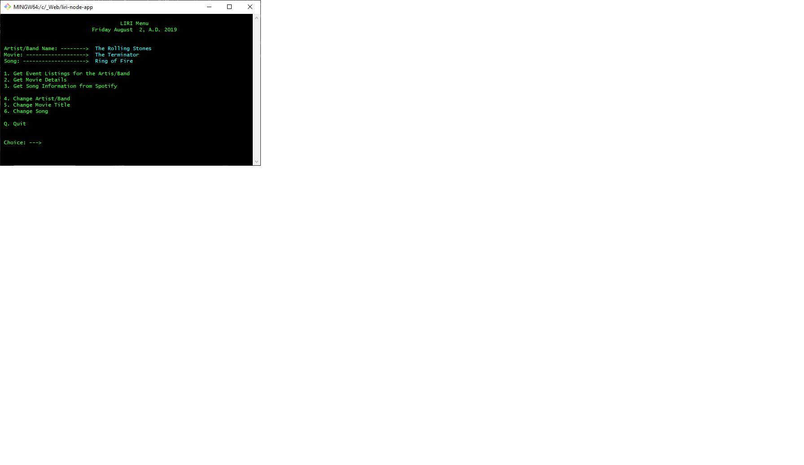

# liri-node-app

## Overview

L.I.R.I, which apparently stands for Language Interface Recognition Interface, is designed to take input from the command line and make calls to various APIs via the Axios package.

The application can be run from a bash or Visual Studio Code terminal window from the command line.  Additionaly, it can be run from the terminal through a handy bash menu script that is started by simply typing: liri.sh

You may have to set the permissions on the file to enable it to be an executable like so:

`chmod +x liri.sh`

The liri.sh menu looks like this on most bash terminals:



If you are working on a Windows system and needed to run the shell scripts on a Linux or Unix system, you would have to use the following code on the *nix system to convert the Windows carriage returns:

`awk '{ sub("\r$", ""); print }' winfile.txt > unixfile.txt`

In some of my testing, I used the following bash emulator: https://bellard.org/jslinux/vm.html?url=https://bellard.org/jslinux/buildroot-x86.cfg

## Required Packages

```
require("dotenv").config();
var moment = require("moment")
var axios = require("axios");
var keys = require("./keys.js");
var Spotify = require("node-spotify-api")
var fs = require("fs")
```

 
 
