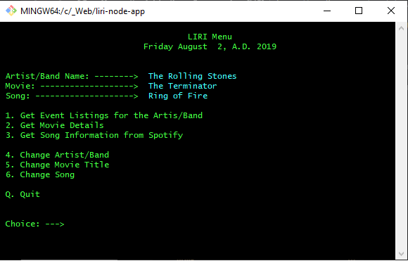

# liri-node-app

## Overview

L.I.R.I, which apparently stands for Language Interface Recognition Interface, is designed to take input from the command line and make calls to various APIs via the Axios package.

The application can be run from a bash or Visual Studio Code terminal window from the command line.  Additionaly, it can be run from the terminal through a handy bash menu script that is started by simply typing: liri.sh

You may have to set the permissions on the file to enable it to be an executable like so:

`chmod +x liri.sh`

The liri.sh menu looks like this on most bash terminals:



If you are working on a Windows system and needed to run the shell scripts on a Linux or Unix system, you would have to use the following code on the *nix system to convert the Windows carriage returns:

`awk '{ sub("\r$", ""); print }' winfile.txt > unixfile.txt`

In some of my testing, I used the following bash emulator: https://bellard.org/jslinux/vm.html?url=https://bellard.org/jslinux/buildroot-x86.cfg

## Required Packages

```js
require("dotenv").config();
var moment = require("moment")
var axios = require("axios");
var keys = require("./keys.js");
var Spotify = require("node-spotify-api")
var fs = require("fs")
```

 Keys for Spotify are stored in a .env file

 ```js
# Spotify API keys

SPOTIFY_ID=your-spotify-id
SPOTIFY_SECRET=your-spotify-secret

```

### What Each Command Does

1. `node liri.js concert-this <artist/band name here>`

   * This will search the Bands in Town Artist Events API (`"https://rest.bandsintown.com/artists/" + artist + "/events?app_id=codingbootcamp"`) for an artist and render the following information about each event to the terminal:

     * Name of the venue

     * Venue location

     * Date of the Event (use moment to format this as "MM/DD/YYYY")

```js
function concertThis() {
    console.log("Parm2: " + parm2)
    var band = parm2.split(' ').join('+')

    axios.get("https://rest.bandsintown.com/artists/" + band + "/events?app_id=codingbootcamp").then(
        function (response) {
            for (var i = 0; i < response.data.length; i++) {
                console.log("Venue Name: " + response.data[i].venue.name)
                console.log("Venue Location: " + response.data[i].venue.city + ", " + response.data[i].venue.region)
                console.log("Date: " + moment(response.data[i].datetime).format("MM/DD/YYYY"))
                console.log("------------------------------------------------")
            }
        }
    )
```

Sample output:


2. `node liri.js spotify-this-song '<song name here>'`

   * This will show the following information about the song in your terminal/bash window

     * Artist(s)

     * The song's name

     * A preview link of the song from Spotify

     * The album that the song is from

   * If no song is provided then the program will default to "Ring of Fire" by Johnny Cash.

```js
function spotifyThis(theSong) {
    // access the key info:
    var spotify = new Spotify(keys.spotify);

    //console.log("Parm2: " + parm2)
    var songName = theSong.split(' ').join('+')
    var queryURL = "https://api.spotify.com/v1/search?q=track: " + songName + "&type=track&limit=10";

    spotify.request(queryURL, function (error, response) {
        if (error) {
            return console.log(error)
        }
        console.log("Artist: " + response.tracks.items[0].artists[0].name)
        console.log("Song: " + response.tracks.items[0].name)
        console.log("URL: " + response.tracks.items[0].preview_url)
        console.log("Album: " + response.tracks.items[0].album.name)
    })
}
```
Sample output:


3. `node liri.js movie-this '<movie name here>'`

   * This will output the following information to your terminal/bash window:

     ```
       * Title of the movie.
       * Year the movie came out.
       * IMDB Rating of the movie.
       * Rotten Tomatoes Rating of the movie.
       * Country where the movie was produced.
       * Language of the movie.
       * Plot of the movie.
       * Actors in the movie.
     ```

   * If the user doesn't type a movie in, the program will output data for the movie 'The Terminator'

```js
function movieThis(theMovie) {
    //console.log("Parm2: " + parm2)
    var title = theMovie.split(' ').join('+')
    var queryURL = "https://www.omdbapi.com/?t=" + title + "&y=&plot=short&apikey=trilogy";

    axios.get(queryURL).then(
        function (response) {
            console.log("------------------------------------------------")
            console.log("Title: " + response.data.Title)
            console.log("Year: " + response.data.Year)
            console.log("IMDB Rating: " + response.data.imdbRating)
            console.log("Metascore: " + response.data.Metascore)
            console.log("Rotten Tomatoes Rating: " + response.data.Ratings[1].Value)
            console.log("Country: " + response.data.Country)
            console.log("Language: " + response.data.Language)
            console.log("Plot: " + response.data.Plot)
            console.log("Actors: " + response.data.Actors)

            console.log("------------------------------------------------")
        }
    )
```

4. `node liri.js do-what-it-says`

   * Using the `fs` Node package, LIRI will take the text inside of random.txt and then use it to call one of LIRI's commands.

     * It runs `spotify-this-song` for "Ring of Fire" as follows the text in `random.txt`.

```js
function readFile() {
    fs.readFile("./random.txt", "utf8", function (error, data) {
        if (error) {
            return console.log("Error reading file! " + error)
        }
        var output = data.split(",")
        console.log("New Parm1: " + output[0])
        console.log("New Parm2: " + output[1])
        parm1 = output[0]
        parm2 = output[1]

        checkParm()
    })
}
```

Sample output:


5. The driver:

```js
function checkParm() {
    if (parm1 == "concert-this") {
        if (parm2) {
            logFile(parm1, parm2)
            concertThis(parm2)
        } else {
            logFile(parm1, "The Rolling Stones")
            concertThis("The Rolling Stones")
        }
    } else if (parm1 == "spotify-this-song") {
        if (parm2) {
            logFile(parm1, parm2)
            spotifyThis(parm2)
        } else {
            logFile(parm1, "Ring of Fire")
            spotifyThis("Ring of Fire")
        }
    } else if (parm1 == "movie-this") {
        if (parm2) {
            logFile(parm1, parm2)
            movieThis(parm2)
        } else {
            logFile(parm1, "The Terminator")
            movieThis("The Terminator")
        }
    } else if (parm1 == "do-what-it-says") {
        logFile(parm1, "")
        readFile()
    } else {
        return
    }
}

```

### BONUS

In addition, all the functions are logged to a log.txt file using the following format:

[date time] "function called" "parm passed"

for example:

```
[2019-08-02 16:04:23] concert-this The Rolling Stones
[2019-08-02 16:13:64] movie-this Idiocracy
[2019-08-02 16:14:31] movie-this The Terminator
```

I also use moment() to format the date:

```js
function logFile(text, text2) {
    var curDate = moment().format("YYYY-MM-DD HH:mm:SS")
    //console.log(`[${curDate}]`)

    var newText = `[${curDate}] ${text} ${text2}\n`

    fs.appendFile("./log.txt", newText, function (error) {
        if (error) {
            return console.log("Error writing to file! " + error)
        }
    })
}
```

Sample output:


### Bonus Bonus

These three bash functions make calls to the liri.js application:

```sh

concertThis () {
  echo " calling liri.js ..."
  echo " passing: \"concert-this\" $artistName"
  node ./liri.js "concert-this" "$artistName"
  read -p $'Press \e[93m<ENTER>\e[92m to return to the menu.'
  mainMenu
}

movieThis () {
  echo " calling liri.js ..."
  echo " passing: \"movie-this\" $movieTitle"
  node ./liri.js "movie-this" "$movieTitle"
  read -p $'Press \e[93m<ENTER>\e[92m to return to the menu.'
  mainMenu
}

spotifyThis () {
  echo " calling liri.js ..."
  echo " passing: \"spotify-this-song\" $songName"
  node ./liri.js "spotify-this-song" "$songName"
  read -p $'Press \e[93m<ENTER>\e[92m to return to the menu.'
  mainMenu
}


```